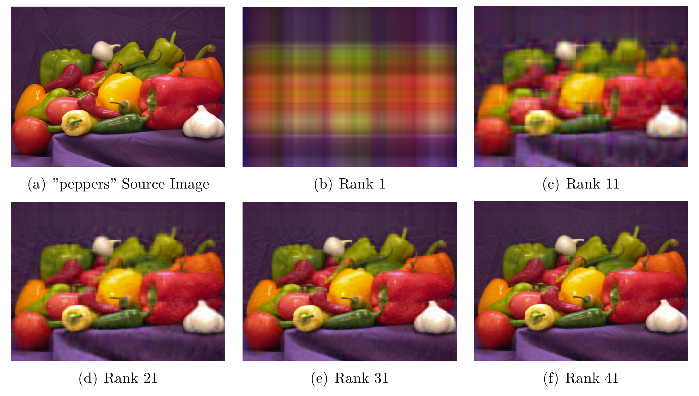
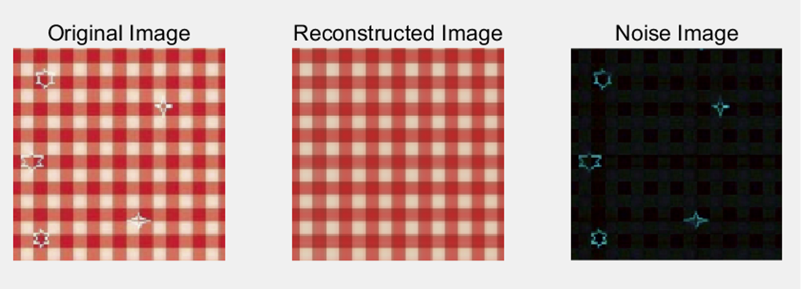

# 作业2：矩阵分解

> 作业 ddl：2025年4月12日（周日）早上 6:00，推荐大家周六完成，不要熬夜。。。

> 迟交政策：4月15日课前提交不超过80分，课后提交不超过60分

> 提交内容：源代码 + 实验报告 + 环境配置文件（C++ / Python）

> 本次作业不统一提供代码框架

### Option 1：SVD 在图像压缩中的应用

**奇异值分解（SVD）** 是一种强大的矩阵分解工具，广泛应用于**图像压缩**任务，具有高效、可解释性强的特点。具体来说，对一张灰度图像（表示为矩阵 $A$ ）进行 SVD 分解 $A = U \Sigma V^T$ ，只保留最大的前 $k$ 个奇异值，即可近似原始图像，同时减少存储空间。   

在本问题中，我们希望实现如下的效果：

    

基于矩阵SVD分解的图像压缩的结果

我们会发现，随着保留的奇异值分解保留的 rank 增长到一定程度，得到的图片与原图片几乎无差异，但是存储量会显著变小。

阅读材料：[奇异值的物理意义是什么？](https://www.zhihu.com/question/22237507)

请大家实现如下任务：

(1) 实现 **SVD 分解**（不可调用库函数），展示数学原理。

(2) 利用 SVD 对图像进行压缩，用多个指标评价图像的压缩效果（如峰值信噪比 PSNR、结构相似性指数 SSIM 等）。

(3) [Optional] 将 SVD 与其他压缩算法进行对比（如离散小波变换 DWT、生成对抗网络 GAN 等）。

请选择本问题的同学**自行搭建**图形用户界面（GUI），鼓励大家使用 AI 做出美观的 GUI（Hint: 这并不简单）。

本问题不统一提供图片，请同学们自行选择。

### Option 2: 低秩分解在图像修复中的应用

**低秩分解（Low-Rank Decomposition）**  是一种重要的矩阵分解方法，在图像修复和数据填补等任务中表现出色。它利用矩阵的低秩结构来提取主要信息，忽略冗余或噪声数据，从而实现高效的去噪和修复。

在第二个任务中，我们希望实现如下的效果：

    

<p style="text-align: center; font-size: 12px; color: #666;"

乍眼一看是不是觉得非常神奇？这里的想法来源于，噪声部分是稀疏的，但是为矩阵带来了很高的秩。Robust PCA 假设一个观测矩阵 $A$ 由两部分组成：

- **低秩矩阵 $L$**：表示主要的结构信息（如图像的主体部分）；  
- **稀疏矩阵 $S$**：表示异常值或噪声（如图像中的损坏区域或遮挡物）。  

即： $A = L + S$ ，其中：
- $L$ 是低秩的（主成分）；  
- $S$ 是稀疏的（损坏或噪声部分）。  

为了从 $A$ 中分解出 $L$ 和 $S$，RPCA 采用如下优化问题：

$$
\min_{L, S} \| L \|_* + \lambda \| S \|_1, \quad \text{s.t.} \quad A = L + S
$$

其中：
- **$\| L \|_*$（核范数，Nuclear Norm）**：即 $L$ 的奇异值之和，用于鼓励 $L$ 具有低秩结构。
- **$\| S \|_1$（L1 范数，Sparse Norm）**：即矩阵元素的绝对值之和，用于鼓励 $S$ 具有稀疏性（仅少量非零元素）。
- **$\lambda$**：权衡低秩部分和稀疏部分的重要性，一般可取 $\lambda = \frac{1}{\max(m, n)}$。

该优化问题可通过 **增强拉格朗日乘子法（ALM）、交替方向乘子法（ADMM）** （请回顾运筹学课程内容）等数值优化方法进行求解。

我们给出如下的三种算法：

(1) [Robust PCA](https://arxiv.org/pdf/0912.3599)

(2) [Optional] [Repairing Sparse Low-rank Texture](https://people.csail.mit.edu/zhangzd/papers/recover_low-rank_texture_final.pdf)

(3) [Optional] [TILT: Transform Invariant Low-rank Textures](https://arxiv.org/pdf/1012.3216)

其中 (1) 为必做内容，(2)(3) 为 RPCA 的改进，为可选内容。

请选择本问题的同学**自行搭建**图形用户界面（GUI），鼓励大家使用 AI 做出美观的 GUI（Hint: 这并不简单）。

本问题不统一提供噪声图片，大家可以自行搜索（Hint: 这很简单，如直接使用论文图片）或自行拍摄噪声图片。

### Option 3: 基于非负矩阵分解的文本主题分析

对多段文本进行分析，我们能够得到一个“词-文档矩阵” $V \in \mathbb{R}^{m \times n}$，其中对应 $m$ 个词（term）， $n$ 篇文档，每个元素 $V_{ij}$ 表示词 $i$ 在文档 $j$ 中出现的频次（或 TF-IDF 权重）。我们希望从词和文档中发现隐藏的语义结构，例如“体育”、“科技”、“政治”等。

**非负矩阵分解 (NMF)**： 我们考虑将 $V$ 近似分解为两个非负矩阵：

$$
V \approx W \cdot H
$$

- $W \in \mathbb{R}^{m \times k}$：**词-主题矩阵**，每一列表示一个主题下各词的权重。
- $H \in \mathbb{R}^{k \times n}$：**主题-文档矩阵**，每一列表示一篇文档在各主题上的权重。
- $k$：主题个数。

由于所有元素非负，分解结果具有自然的可加性与可解释性：一个主题可以解释为若干词的加权组合。

阅读材料：[非负矩阵分解(NMF)简介](https://zhuanlan.zhihu.com/p/22043930)

参考文献：[Algorithms for Non-negative Matrix Factorization](http://luthuli.cs.uiuc.edu/~daf/courses/Opt-2019/Papers/lee01algorithms.pdf)

请大家按照如下步骤，实现对多段文本的主题分析：

(1) 选择（你喜欢的）几个主题（如游戏、体育、政治等，使得各个主题尽量不重合），选择和各个主题关联性强的多个关键词。

(2) 去网络上搜索各个主题的多段文本（如新闻、文章、评论等），对这些文本进行处理，构建“词-文档矩阵”（可调用库函数）。

(3) 实现 **非负矩阵分解 (NMF)** 算法（不可调用库函数），展示数学原理，利用算法对文本进行主题分析，展示其效果。

(4) [Optional] 将 NMF 的效果与其他算法（如 SVD，LDA）进行对比，其他算法可调用库函数。

## 实验报告要求

- 数学建模：将原问题转化为定义清晰的数学问题，构建明确的数学模型。
- 阐述算法：简明扼要地解释核心算法，叙述基本原理和关键步骤。对于能够通过流程图或伪代码清晰说明的内容，应避免展示大段源代码或代码分析。
- 结果展示：将主要的实验结果通过图表的方式展示出来，并给出必要、扎实的分析说明。
- 评分不比较报告的字数页数，加分在于拓展而非堆砌。
- 在完成上述核心部分的基础上，任何体现思考和创新的出色拓展均可加分；其余部分（如前言、相关工作等）请务必精简。
- 若使用 AI 辅助，请在报告中简要说明用途，同时请对 AI 生成内容进行高度提炼和整合，确保报告精炼并体现个人思考。
